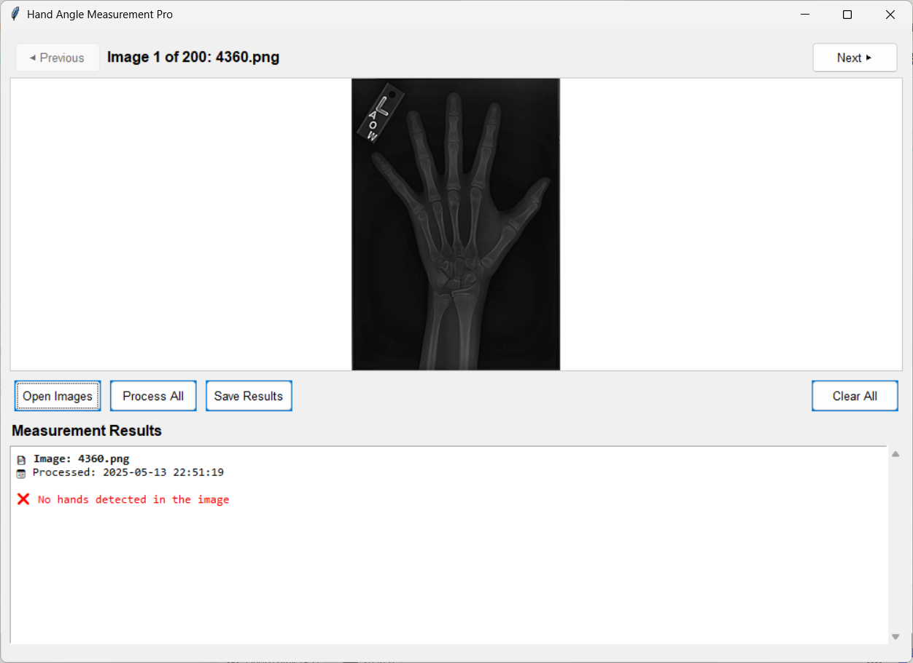
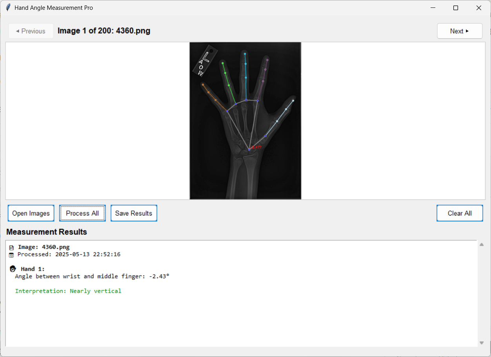

# 🖐️ HandCheckAI

**HandCheckAI** là một ứng dụng giao diện đồ họa (GUI) giúp bạn đo các góc trên bàn tay từ ảnh đầu vào bằng cách sử dụng **MediaPipe**, **OpenCV**, và **Tkinter**. Phù hợp để phân tích động tác tay trong vật lý trị liệu, giáo dục, hoặc nghiên cứu khoa học.

---

## 🔧 Tính năng chính

- Tải ảnh tay từ thư mục
- Tự động phát hiện và vẽ landmark bàn tay
- Tính toán các góc quan trọng trên ngón tay
- Duyệt từng ảnh hoặc xử lý hàng loạt
- Lưu kết quả vào file Excel (.xlsx)


## 🚀 Cài đặt

### 1. Clone dự án

```bash
git clone https://github.com/bbqqvv/HandCheckAI.git
cd HandCheckAI
````

### 2. Tạo và kích hoạt môi trường ảo

```bash
python -m venv .venv
```

* **Windows**:

  ```bash
  .venv\Scripts\activate
  ```

* **macOS/Linux**:

  ```bash
  source .venv/bin/activate
  ```

### 3. Cài đặt thư viện

```bash
pip install -r requirements.txt
```

> Hoặc nếu không có file `requirements.txt`, hãy cài thủ công:

```bash
pip install mediapipe opencv-python numpy Pillow openpyxl
```

---

## ▶️ Chạy ứng dụng

```bash
python HandCheckAI.py
```

---

## 🧑‍💻 Cách sử dụng

| Nút chức năng    | Mô tả                                |
| ---------------- | ------------------------------------ |
| **Open Images**  | Chọn thư mục chứa ảnh tay            |
| **Process All**  | Phân tích và tính góc cho tất cả ảnh |
| **Save Results** | Lưu dữ liệu đo được vào Excel        |
| **Clear All**    | Xóa dữ liệu và làm sạch giao diện    |

---

## 📂 Đầu ra

- **File Excel (.xlsx)**: chứa thông tin tên ảnh và các góc đo được  
- **Giao diện**: hiển thị ảnh gốc và kết quả vẽ landmark + góc

<div style="display: flex; gap: 10px; justify-content: start;">
  
  
</div>

---

## 🛠️ Ghi chú kỹ thuật

* Ứng dụng sử dụng `MediaPipe Hands` của Google để nhận diện tay
* Hỗ trợ 1–2 bàn tay trong mỗi ảnh
* Khuyến khích ảnh đầu vào là **hình vuông** hoặc được resize để tránh cảnh báo từ MediaPipe

---

## ⚠️ Cảnh báo & khắc phục

| Lỗi hoặc cảnh báo     | Nguyên nhân                   | Giải pháp                           |
| --------------------- | ----------------------------- | ----------------------------------- |
| `Mean of empty slice` | Không phát hiện được landmark | Kiểm tra lại ảnh đầu vào            |
| `NORM_RECT` warning   | Thiếu kích thước ảnh          | Resize ảnh đầu vào thành hình vuông |
| Không thấy landmark   | Tay bị mờ hoặc quá nhỏ        | Dùng ảnh rõ ràng hơn, đủ sáng       |

---

## 📜 Giấy phép

Dự án phát hành theo giấy phép [MIT](LICENSE).

---

## ❤️ Đóng góp

Bạn có thể đóng góp bằng cách:

* Mở issue nếu phát hiện lỗi
* Gửi pull request để cải thiện tính năng
* Đề xuất tính năng mới

---

## 👤 Tác giả

[bbqqvv](https://github.com/bbqqvv)
